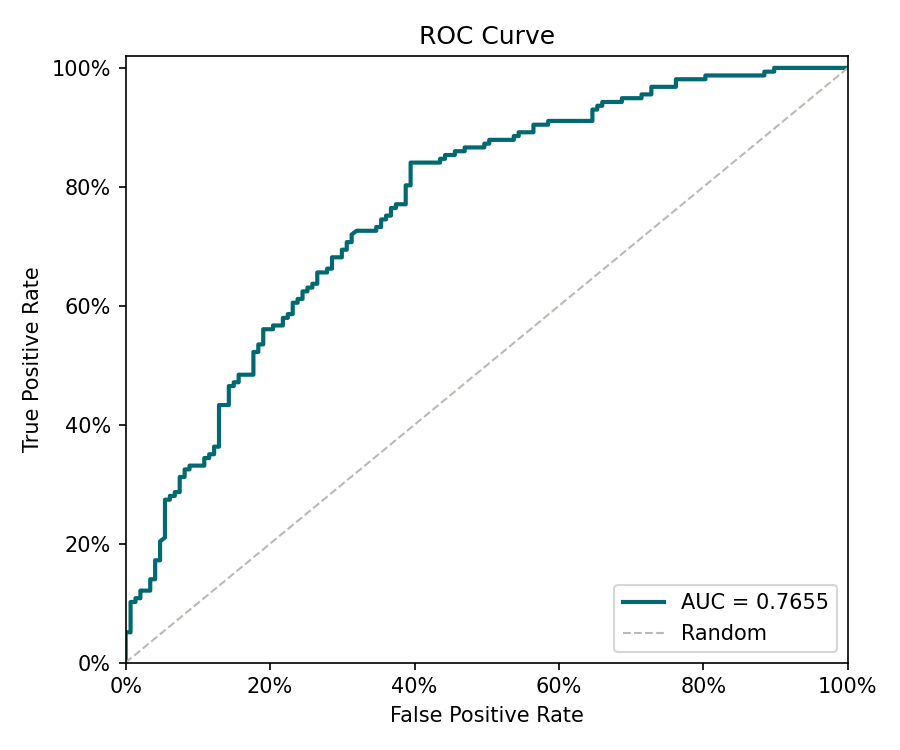
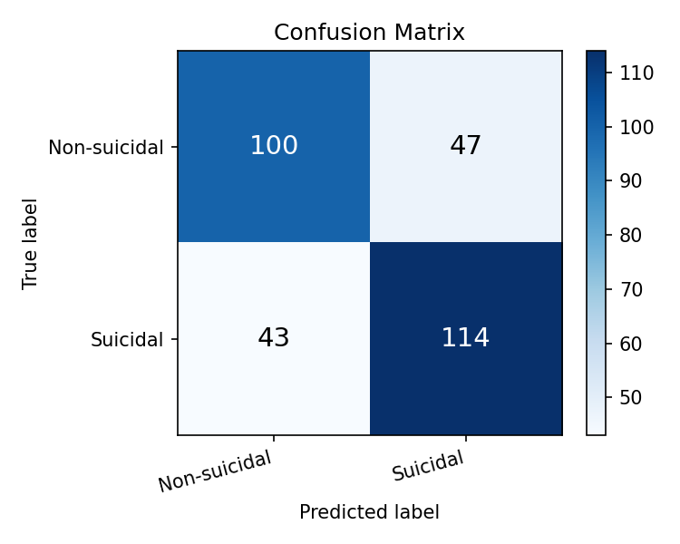

# Reporte de Entrenamiento — Detección de Ideación Suicida

_Generado: 2026-05-15 23:14_

## Métricas sobre el conjunto de prueba

| Métrica | Valor |
|---------|-------|
| AUC | **0.7655** |
| F1 | 0.717 |
| Precision | 0.7081 |
| Recall (TPR) | 0.7261 |
| FPR | 0.3197 |

## Matriz de confusión

| | Pred. Negativo | Pred. Positivo |
|--|--|--|
| **Real Negativo** | TN = 100 | FP = 47 |
| **Real Positivo** | FN = 43 | TP = 114 |

## Validación cruzada (K-Fold)

| Fold | AUC |
|------|-----|
| Fold 1 | 0.7604 |
| Fold 2 | 0.7739 |
| Fold 3 | 0.7593 |
| Fold 4 | 0.7579 |
| Fold 5 | 0.7755 |
| **Promedio** | **0.7654** |
| **Std** | 0.0076 |

## Curva ROC

## Matriz de confusión (visualización)

