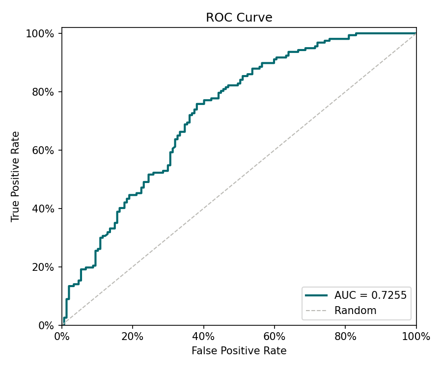
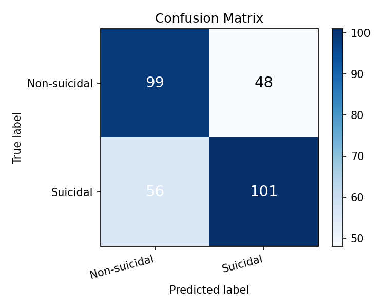

# Reporte de Entrenamiento — Detección de Ideación Suicida

_Generado: 2026-05-14 17:45_

## Métricas sobre el conjunto de prueba

| Métrica | Valor |
|---------|-------|
| AUC | **0.7255** |
| F1 | 0.6601 |
| Precision | 0.6779 |
| Recall (TPR) | 0.6433 |
| FPR | 0.3265 |

## Matriz de confusión

| | Pred. Negativo | Pred. Positivo |
|--|--|--|
| **Real Negativo** | TN = 99 | FP = 48 |
| **Real Positivo** | FN = 56 | TP = 101 |

## Validación cruzada (K-Fold)

| Fold | AUC |
|------|-----|
| Fold 1 | 0.8214 |
| Fold 2 | 0.7744 |
| Fold 3 | 0.7964 |
| Fold 4 | 0.7745 |
| Fold 5 | 0.7590 |
| **Promedio** | **0.7852** |
| **Std** | 0.0217 |

## Curva ROC

## Matriz de confusión (visualización)

