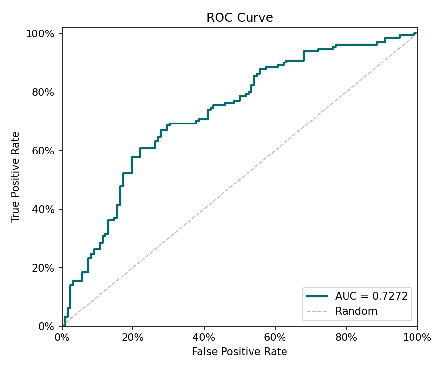
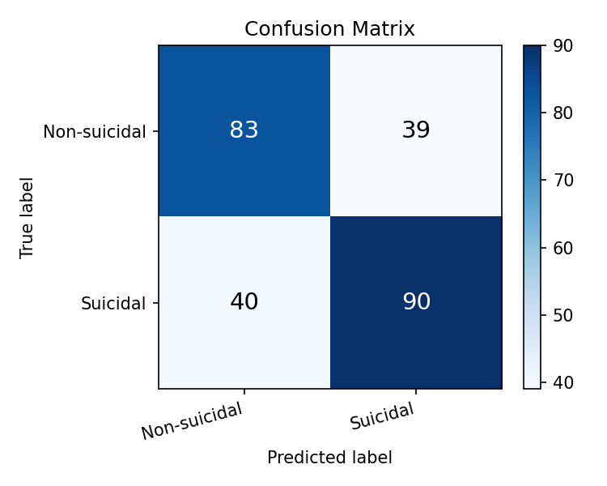

# Reporte de Evaluación — Detección de Ideación Suicida (Test Fold)

_Generado: 2026-05-14 17:14_

## Métricas sobre el conjunto de prueba

| Métrica | Valor |
|---------|-------|
| AUC | **0.7272** |
| F1 | 0.695 |
| Precision | 0.6977 |
| Recall (TPR) | 0.6923 |
| FPR | 0.3197 |

## Matriz de confusión

| | Pred. Negativo | Pred. Positivo |
|--|--|--|
| **Real Negativo** | TN = 83 | FP = 39 |
| **Real Positivo** | FN = 40 | TP = 90 |

## Curva ROC

## Matriz de confusión (visualización)

