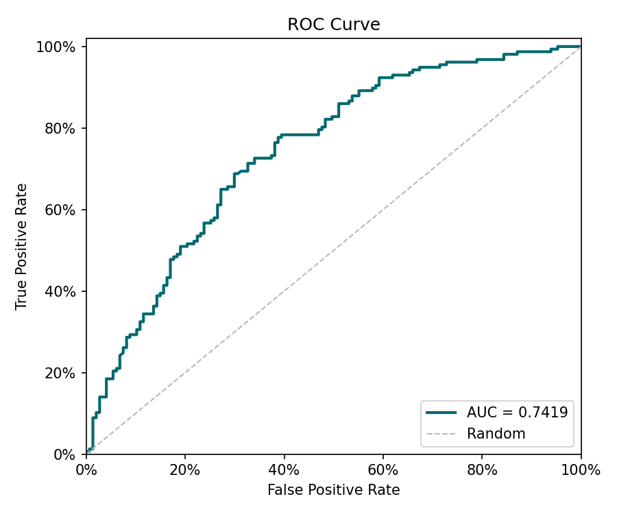
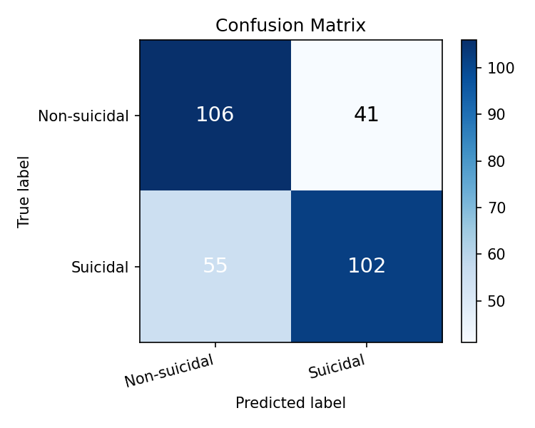

# Reporte de Entrenamiento — Detección de Ideación Suicida

_Generado: 2026-05-15 23:02_

## Métricas sobre el conjunto de prueba

| Métrica | Valor |
|---------|-------|
| AUC | **0.7419** |
| F1 | 0.68 |
| Precision | 0.7133 |
| Recall (TPR) | 0.6497 |
| FPR | 0.2789 |

## Matriz de confusión

| | Pred. Negativo | Pred. Positivo |
|--|--|--|
| **Real Negativo** | TN = 106 | FP = 41 |
| **Real Positivo** | FN = 55 | TP = 102 |

## Validación cruzada (K-Fold)

| Fold | AUC |
|------|-----|
| Fold 1 | 0.8101 |
| Fold 2 | 0.7772 |
| Fold 3 | 0.7405 |
| Fold 4 | 0.7341 |
| Fold 5 | 0.7547 |
| **Promedio** | **0.7633** |
| **Std** | 0.0277 |

## Curva ROC

## Matriz de confusión (visualización)

