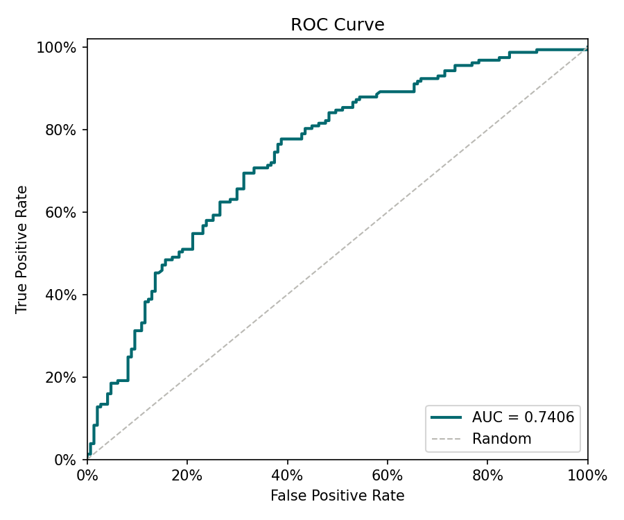
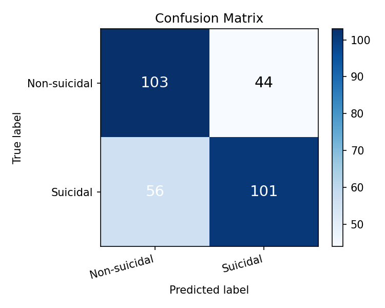

# Reporte de Entrenamiento — Detección de Ideación Suicida

_Generado: 2026-05-14 17:12_

## Métricas sobre el conjunto de prueba

| Métrica | Valor |
|---------|-------|
| AUC | **0.7406** |
| F1 | 0.6689 |
| Precision | 0.6966 |
| Recall (TPR) | 0.6433 |
| FPR | 0.2993 |

## Matriz de confusión

| | Pred. Negativo | Pred. Positivo |
|--|--|--|
| **Real Negativo** | TN = 103 | FP = 44 |
| **Real Positivo** | FN = 56 | TP = 101 |

## Validación cruzada (K-Fold)

| Fold | AUC |
|------|-----|
| Fold 1 | 0.7884 |
| Fold 2 | 0.7457 |
| Fold 3 | 0.7591 |
| Fold 4 | 0.7259 |
| Fold 5 | 0.7285 |
| **Promedio** | **0.7495** |
| **Std** | 0.0229 |

## Curva ROC

## Matriz de confusión (visualización)

