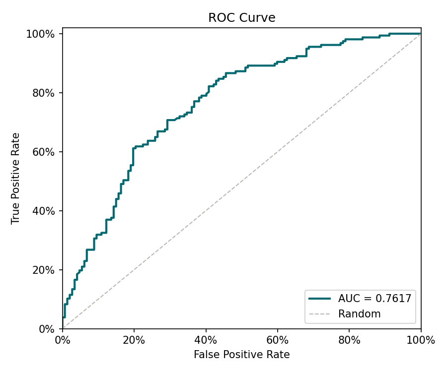
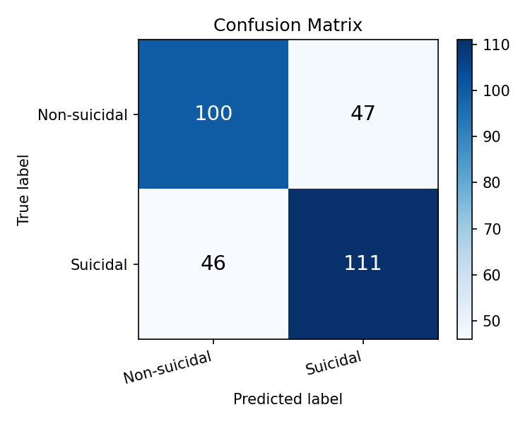

# Reporte de Entrenamiento — Detección de Ideación Suicida

_Generado: 2026-05-15 23:10_

## Métricas sobre el conjunto de prueba

| Métrica | Valor |
|---------|-------|
| AUC | **0.7617** |
| F1 | 0.7048 |
| Precision | 0.7025 |
| Recall (TPR) | 0.707 |
| FPR | 0.3197 |

## Matriz de confusión

| | Pred. Negativo | Pred. Positivo |
|--|--|--|
| **Real Negativo** | TN = 100 | FP = 47 |
| **Real Positivo** | FN = 46 | TP = 111 |

## Validación cruzada (K-Fold)

| Fold | AUC |
|------|-----|
| Fold 1 | 0.7446 |
| Fold 2 | 0.7633 |
| Fold 3 | 0.7565 |
| Fold 4 | 0.7448 |
| Fold 5 | 0.7735 |
| **Promedio** | **0.7565** |
| **Std** | 0.0111 |

## Curva ROC

## Matriz de confusión (visualización)

