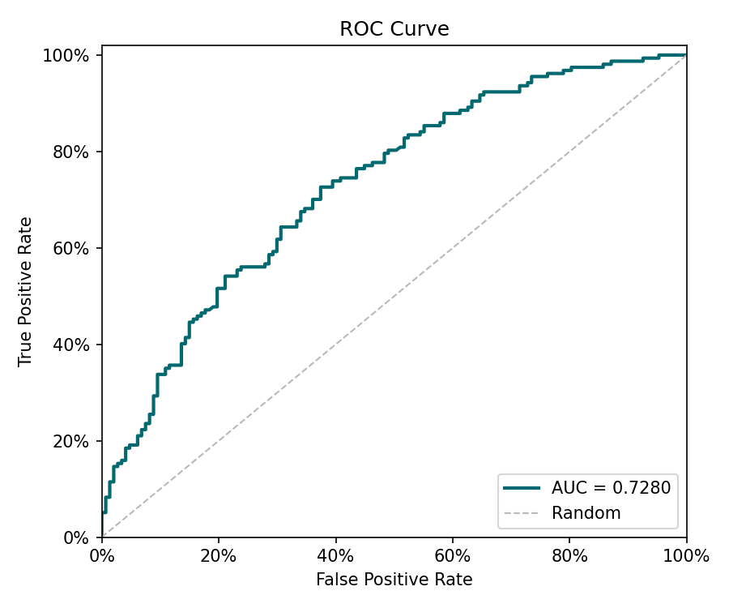
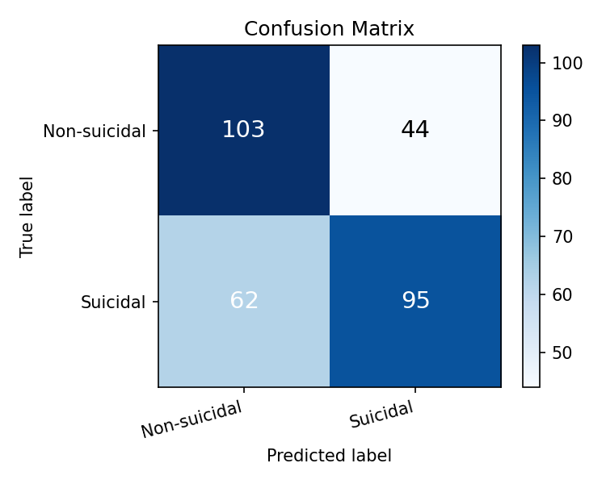

# Reporte de Entrenamiento — Detección de Ideación Suicida

_Generado: 2026-05-15 23:26_

## Métricas sobre el conjunto de prueba

| Métrica | Valor |
|---------|-------|
| AUC | **0.728** |
| F1 | 0.6419 |
| Precision | 0.6835 |
| Recall (TPR) | 0.6051 |
| FPR | 0.2993 |

## Matriz de confusión

| | Pred. Negativo | Pred. Positivo |
|--|--|--|
| **Real Negativo** | TN = 103 | FP = 44 |
| **Real Positivo** | FN = 62 | TP = 95 |

## Validación cruzada (K-Fold)

| Fold | AUC |
|------|-----|
| Fold 1 | 0.8186 |
| Fold 2 | 0.7673 |
| Fold 3 | 0.7840 |
| Fold 4 | 0.7525 |
| Fold 5 | 0.7467 |
| **Promedio** | **0.7738** |
| **Std** | 0.0258 |

## Curva ROC

## Matriz de confusión (visualización)

